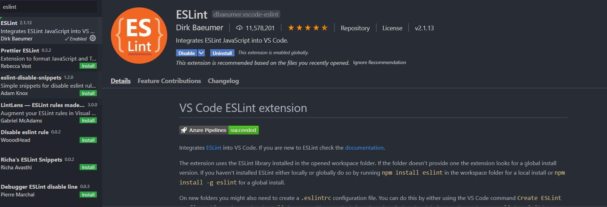
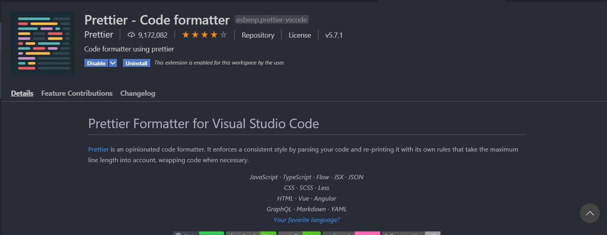
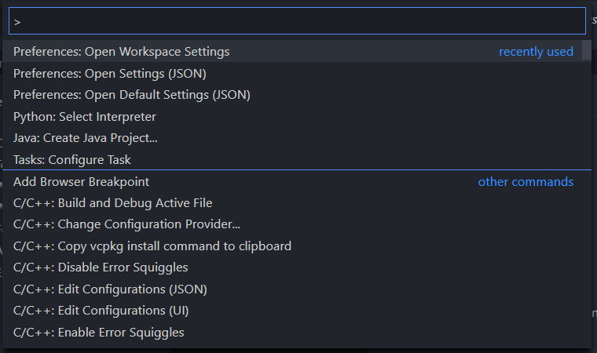
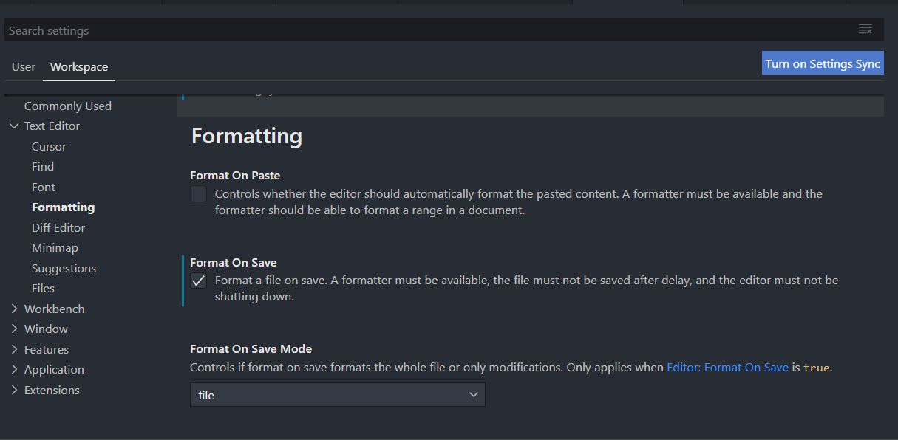

## Set up environment

Clone the source locally:

```sh
$ git clone https://github.com/phast184/link-checker-tool.git
$ cd link-checker-tool
```
Install project dependencies:

```sh
$ npm install
```

```sh
$ npm link
```

Formatting you code using prettier
```
$ npx prettier --write .

```
The command above allows us to format our code by using Prettier which is detailly documented at [prettier documentation.](https://prettier.io/docs/en/install.html).

Avoiding silly mistake by using ESlint
```
$ npx eslint .

```
The command above allows to identify all silly mistakes in our app. Read more about esLint and its usage at  [ESLint documentation](hhttps://eslint.org/docs/user-guide/getting-started).

## Automate ESLint and Prettier in VSCode
The automation of such tools like ESLint and Prettier in our editor makes a better workspace for our developer. Therefore, our code will be formatted automatically thanks to Prettier and we could fix any mistakes as soon as ESLint detects them.

* Firstly, install Prettier and ESLint from VSCode extension




* At this step, ESLint will automatically work every time we code in VSCode

* To auto-format after each save, we have to open command palette using `Ctrl+Shift+P` and choose `Open Workspace Settings`



* In `Formatting`, choose `Format on Save` to allow Prettier auto-format our code after each save.


## Contribute to automated test units

### How to run test
* Currently, I'm using Jest to framework to manage my tests. 

* You can run test by using the command below.

```
$ npm run test

```

* To contribute to the test library, please use the command below. This command will display how many functions which need to be tested.

```
$ npm run coverage

```

The test file is in "test/urlFunctions.test.js". Feel free to contribute. Much appreciation.